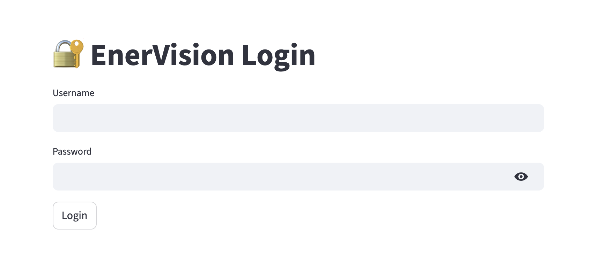
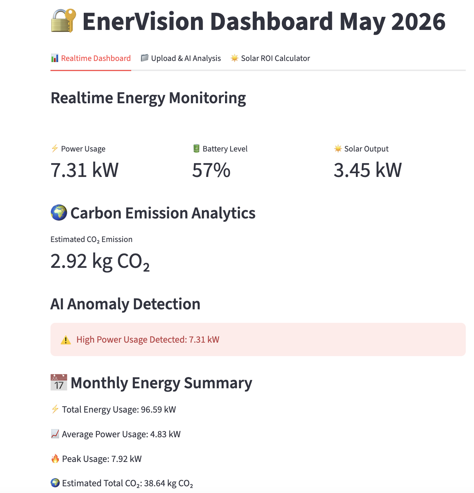
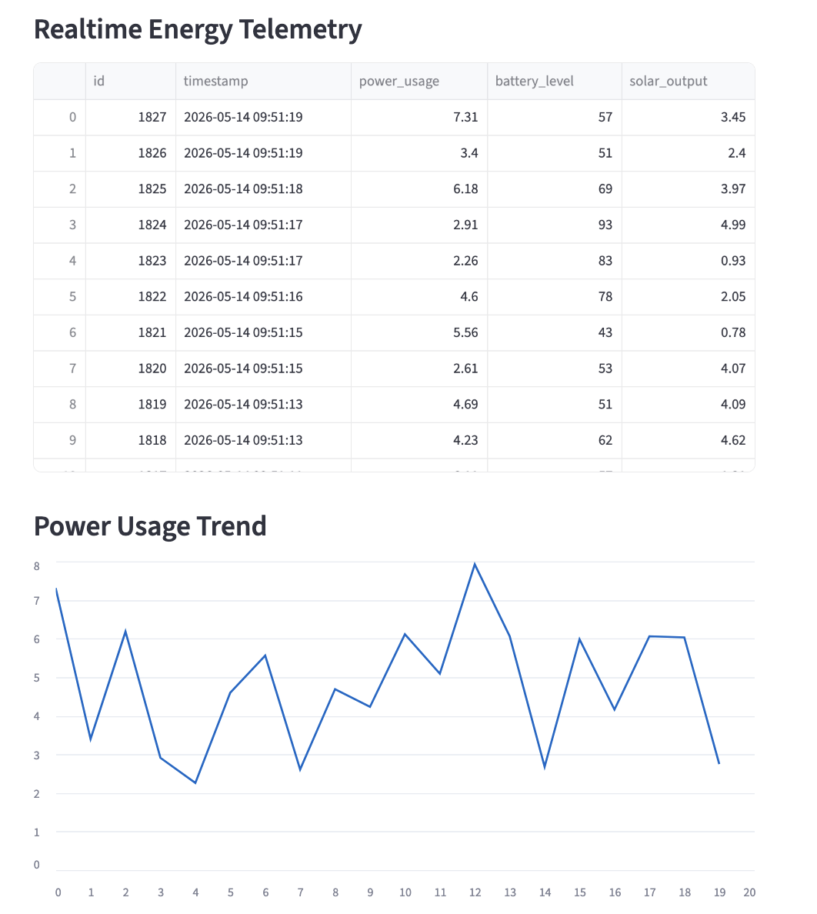
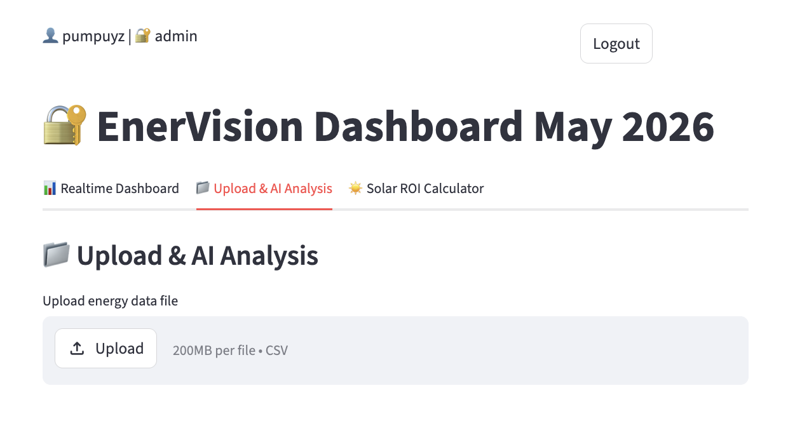
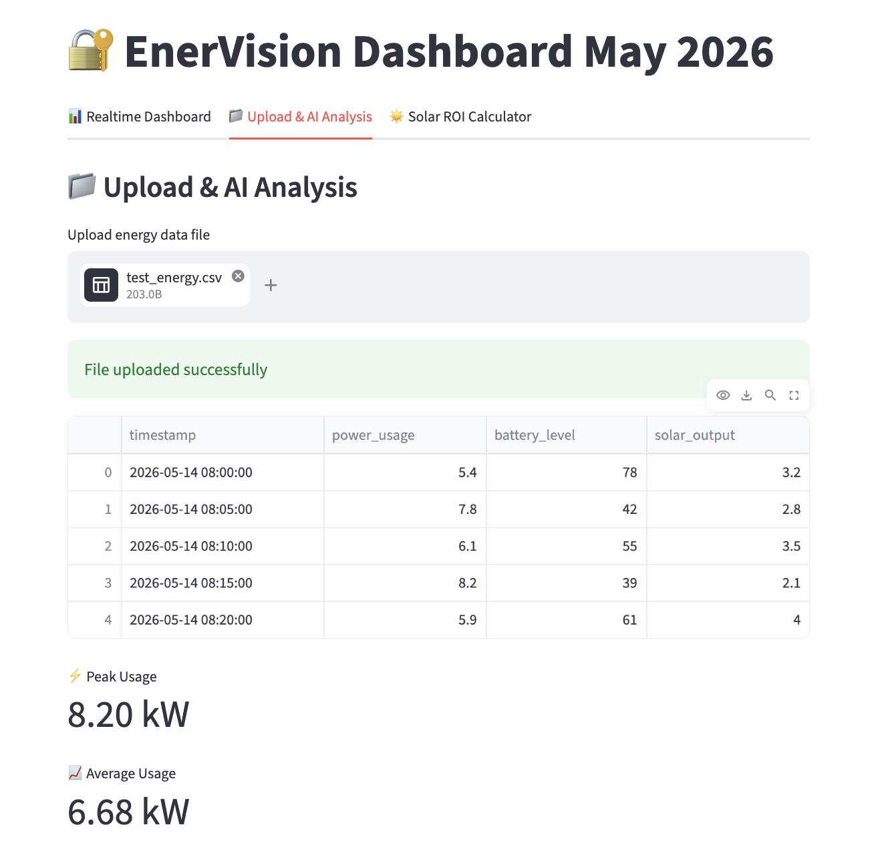
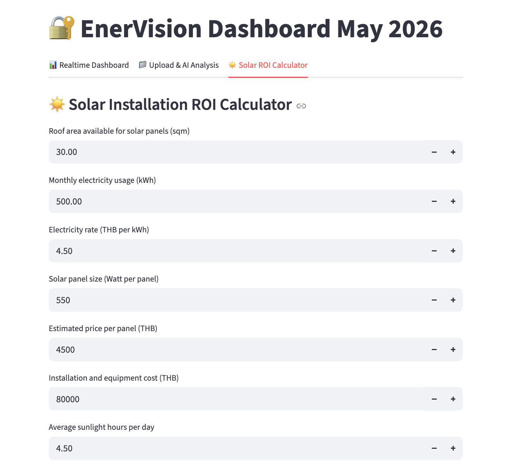
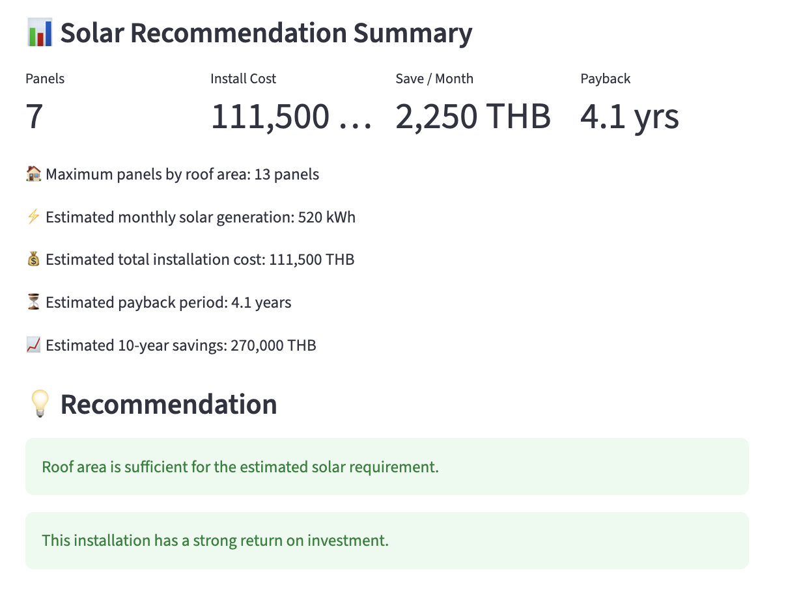

# ⚡ EnerVision AI

## Overview

EnerVision AI is an AI-powered energy monitoring and analytics platform designed for realtime telemetry processing, anomaly detection, energy forecasting, sustainability reporting, and solar investment planning.

The platform combines:

- Realtime MQTT telemetry
- AI analytics
- Secure authentication (JWT + RBAC)
- Solar ROI estimation
- Dashboard visualization
- PDF/CSV reporting

---

# 🚀 Features

- Realtime energy monitoring dashboard
- MQTT-based telemetry streaming
- AI anomaly detection
- Energy forecasting analytics
- Carbon emission analytics
- Upload & AI file analysis
- CSV export and PDF reporting

## 🔐 Authentication & User Management

- JWT authentication
- Dashboard login/logout
- User registration
- Password hashing with bcrypt
- SQLite user management
- User Profile API (`GET /me`)
- Role-based access control (RBAC)
- Real user role retrieval
- Admin-only API protection
- Dynamic role updates
- Admin and viewer roles

## ☀️ Solar ROI Calculator

- Roof area estimation
- Solar panel recommendation
- Installation cost estimation
- Monthly savings prediction
- Payback period calculation
- 10-year savings estimation

## 📊 Dashboard Modules

- Realtime Dashboard
- Upload & AI Analysis
- Solar ROI Calculator
- User profile display
- Role-aware access
- Admin dashboard
- User role management
- Dynamic role updates


## 🚀 Deployment

- Docker support
- MacOS support
- Windows support

---

# 🧠 Technology Stack

| Layer | Technology |
|---|---|
| Frontend | Streamlit |
| Backend | FastAPI |
| Messaging | MQTT |
| Database | SQLite |
| Authentication | JWT + bcrypt + RBAC |
| AI / ML | scikit-learn |
| Data Processing | Pandas / NumPy |
| Reporting | ReportLab |
| Deployment | Docker |

---

# 📸 Dashboard Modules

## 📊 Realtime Dashboard

- Realtime telemetry monitoring
- AI anomaly detection
- Energy forecasting
- Carbon analytics
- PDF & CSV reporting

## 📁 Upload & AI Analysis

- Upload CSV files
- AI analysis and recommendations
- Peak usage detection
- Battery health analysis

## ☀️ Solar ROI Calculator

- Roof area estimation
- Solar panel recommendation
- Installation cost estimation
- Monthly savings calculation
- Payback period estimation
- 10-year savings prediction

## 👑 Admin Panel

- View users
- Check user roles
- Admin-only access
- Update user roles

---

# 📸 Screenshots

## 🔐 Login



## 📊 Realtime Dashboard




## 📁 Upload & AI Analysis




## ☀️ Solar ROI Calculator




---

# 🔄 User Workflow

```text
Login
↓
Realtime Dashboard
↓
AI Monitoring
↓
Forecasting
↓
Reports
↓
Solar ROI Planning
↓
Admin Role Management
```

---

# 🏗️ Architecture Diagram

```text
                    ┌──────────────────────┐
                    │     User / Client    │
                    └──────────┬───────────┘
                               │
                               │ Login / JWT
                               ▼
                    ┌──────────────────────┐
                    │ Authentication Layer │
                    │ JWT + bcrypt + RBAC  │
                    └──────────┬───────────┘
                               │
                               ▼
                    ┌──────────────────────┐
                    │     FastAPI API      │
                    │ Protected Endpoints  │
                    └──────────┬───────────┘
                               │
         ┌─────────────────────┴─────────────────────┐
         │                                           │
         ▼                                           ▼
┌──────────────────────┐                ┌──────────────────────┐
│      SQLite DB       │                │   MQTT Telemetry     │
│ Users + Energy Data  │                │  Energy Simulator    │
└──────────┬───────────┘                └──────────┬───────────┘
           │                                       │
           └─────────────────┬─────────────────────┘
                             ▼
                  ┌─────────────────────────┐
                  │ AI Analytics Engine     │
                  │ Alerts + Forecasting    │
                  └──────────┬──────────────┘
                             ▼
                  ┌─────────────────────────┐
                  │ Streamlit Dashboard     │
                  │ Monitoring & Reports    │
                  └─────────────────────────┘
```

---

# 📦 Local Setup

## Clone Repository

```bash
git clone https://github.com/VorakranPP/enervision-ai.git
cd enervision-ai
```

## Install Dependencies

```bash
pip3 install -r requirements.txt
```

## Run Dashboard

```bash
python3 -m streamlit run dashboard/dashboard.py
```

## Run API

```bash
uvicorn backend.api:app --reload
```

---

# 🐳 Docker Deployment

## Build Docker Image

```bash
docker build -t enervision-ai .
```

## Run Container

```bash
docker run -p 8501:8501 enervision-ai
```

---

# 📦 Git Workflow

```bash
git add .
git commit -m "Update project"
git push
```

---

# 🔌 FastAPI Backend

## API Documentation

```text
http://127.0.0.1:8000/docs
```

## Available API Endpoints

| Endpoint | Description |
|---|---|
| GET `/` | API root endpoint |
| POST `/register` | Register new user |
| POST `/token` | Login & generate JWT |
| GET `/me` | Current authenticated user profile |
| GET `/users` | List all users (admin only) |
| PUT `/users/{username}/role` | Update user role (admin only) |
| GET `/health` | System health check |
| GET `/telemetry` | Latest telemetry data |
| GET `/summary` | Energy analytics summary |
| GET `/alerts` | Active system alerts |
| GET `/recommendations` | AI operational recommendations |
| GET `/system-status` | Overall system condition |
| GET `/trend-analysis` | Historical energy trend analysis |

---

# 🌐 Dashboard

```text
http://localhost:8501
```

---

# 🧠 AI Analytics

The platform includes:

- Threshold-based anomaly detection
- Energy forecasting using Linear Regression
- Carbon emission estimation
- AI-generated operational recommendations

## Example Recommendations

- Reduce HVAC usage during peak hours
- Shift non-critical loads
- Improve battery charging schedules
- Optimize solar utilization

---

# 🔐 Authentication & User Management

EnerVision AI includes:

- User registration (`POST /register`)
- User login (`POST /token`)
- JWT authentication
- bcrypt password hashing
- SQLite user storage
- User Profile API (`GET /me`)
- Role-based access control (RBAC)
- Real role retrieval from database
- Admin-only API protection
- Dynamic role updates
- Protected APIs

## Authentication Flow

```text
Register User
↓
Store User in SQLite
↓
Hash Password (bcrypt)
↓
Login
↓
Generate JWT Token
↓
GET /me
↓
Role Verification (admin / viewer)
↓
Access Protected APIs
```

## Roles

| Role | Permissions |
|---|---|
| admin | Create users, update roles, access protected APIs |
| viewer | Read-only access |

## Protected Endpoints

| Endpoint | Authentication |
|---|---|
| GET `/summary` | 🔒 Required |
| GET `/alerts` | 🔒 Required |
| GET `/recommendations` | 🔒 Required |
| GET `/system-status` | 🔒 Required |
| GET `/trend-analysis` | 🔒 Required |
| GET `/me` | 🔒 Required |
| GET `/users` | 🔒 Admin only |
| PUT `/users/{username}/role` | 🔒 Admin only |
| POST `/register` | 🔒 Admin only |

## Public Endpoints

| Endpoint | Description |
|---|---|
| POST `/token` | Login |
| GET `/telemetry` | Telemetry |
| GET `/health` | Health check |

---

# 📈 Example Use Cases

- Smart Building Monitoring
- Renewable Energy Analytics
- Energy Consumption Optimization
- ESG & Sustainability Reporting
- Operational Energy Insights
- Solar investment planning

---

# 🌍 Business Value

EnerVision AI helps organizations:

- Monitor realtime energy usage
- Detect abnormal consumption patterns
- Improve operational visibility
- Support sustainability initiatives
- Generate AI-driven recommendations
- Analyze historical energy trends
- Estimate solar installation return on investment

---

# 🔮 Future Roadmap

- PostgreSQL migration
- Cloud deployment (AWS)
- AWS IoT Core integration
- Multi-site monitoring
- Predictive maintenance
- Advanced ML forecasting
- Email alerting
- Kubernetes deployment
- Real solar recommendation engine
- UI-based role management dashboard
- Grafana integration
- Prometheus monitoring

---

# 👨‍💻 Author

**Vorakran Trisilanun (PP)**

IT Manager | Network Engineer | Cloud & Infrastructure Enthusiast | AI & IoT Builder

Built as a portfolio and learning project focused on:

- AI
- IoT
- Energy analytics
- Solar planning
- Secure backend systems
- Cloud-native architecture
- Authentication and RBAC

---

## ⭐ Current Version

EnerVision AI v2.6

Latest additions:

Latest additions:

- Dashboard login/logout

- Role-based user sessions

- Solar ROI calculator

- GET /me API

- RBAC (admin / viewer)

- Admin-only endpoints

- Dynamic role updates

- Admin dashboard

- User role management